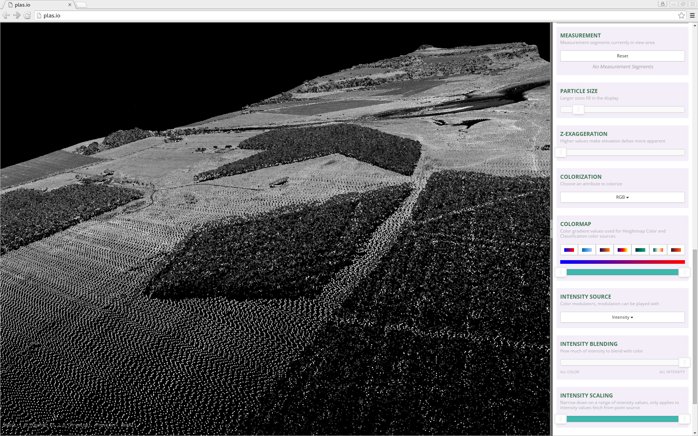
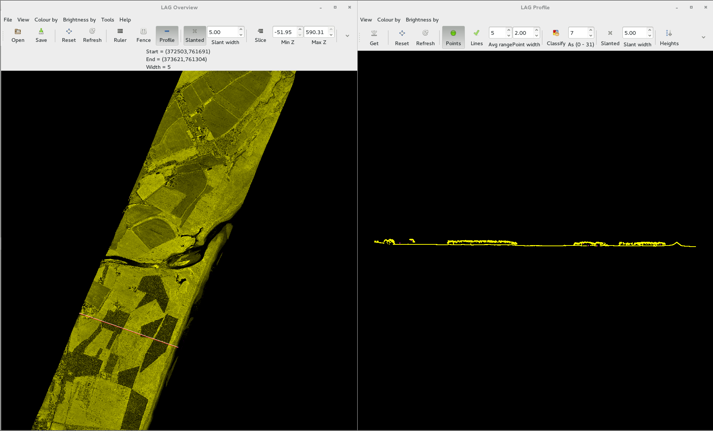
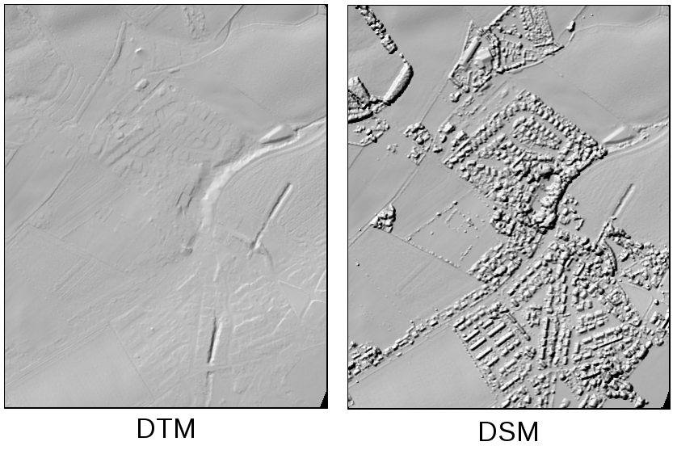
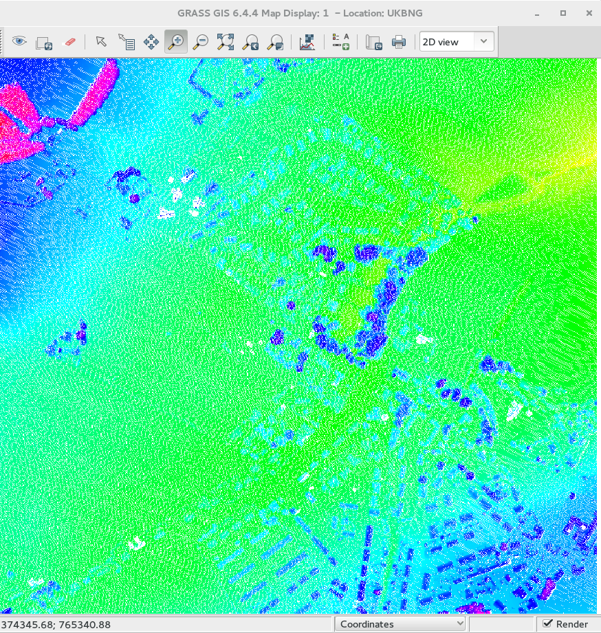
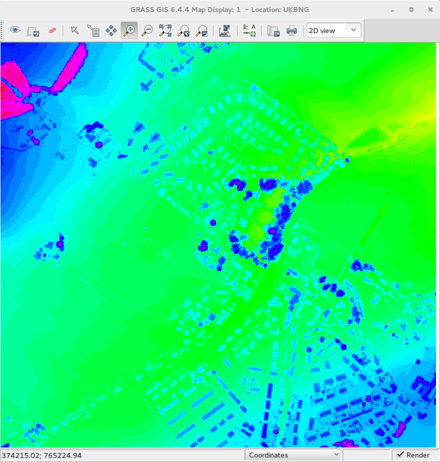

ARSF Workshop - Discrete LiDAR Practical
==========================================

This worksheet is for Linux, it is identical to the Windows version but scripts have the extension `.py` and lines are broken by `\` rather than `^`.

## Datasets and computing set up ##

This tutorial uses the ARSF DEM Scripts, developed by ARSF-DAN and available to download from
[https://github.com/pmlrsg/arsf_dem_scripts](https://github.com/pmlrsg/arsf_dem_scripts).
You will need to have these scripts installed before starting the tutorial.

LiDAR data from two flights will be used for this tutorial. If you are using an ARSF computer or the Virtual Machine these data are under:

~/arsf_workshop/lidar_practical

If you are using your own machine you will need to download the data from [NEODC](http://neodc.nerc.ac.uk/).

### EUFAR11/02 187 ###

Data acquired over Svalbard on day 187/2011 ([NEODC Link](http://browse.ceda.ac.uk/browse/neodc/arsf/2011/EUFAR11_02/EUFAR11_02-2011_187_SVALBD_PGLACIAL/LiDAR))
For this tutorial LAS 1.0 files 1 - 10 will be used. The ASTER DEM supplied with the hyperspectral data will also be used.

### GB13/08 217 ###

Data acquired over Montrose Bay on day 217/2014 ([NEODC Link](http://browse.ceda.ac.uk/browse/neodc/arsf/2014/GB13_08/GB13_08-2014_217_Montrose_Bay/LiDAR))
For this tutorial LAS 1.2 file 2 will be used. The LAS 1.3 file will also be used for the full waveform practical.

## View Point Cloud ##

ARSF deliver LiDAR data as point clouds. Before starting analysis open the point cloud using the online plas.io viewer or ARSF's Lidar Analysis GUI ([LAG](http://arsf.github.io/lag/)) viewer..


### plas.io ###

1) Open [https://plas.io/](https://plas.io/) in your browser (Chrome is recommended).

2) Click browse and navigate to one of the practical LAS files to display

3) You can use the mouse to rotate and pan around the dataset.

4) Zoom in close (scroll wheel) to see the individual points.



### LAG ###

1) Open a terminal window (look for a black rectangular icon with a white frame, normally under the 'Applications' menu) and type `lag` to open LAG.

2) Click the 'Open' button and select a LAS file.

3) Using the 'Profile' tool draw a line along the dataset in the 'LAG Overview' window and press the spacebar to display a profile.

4) Select 'Colour by' and 'Classification' in both windows to display points flagged as noise.



## Create a simple DSM using the command line utility ##

The fist task is to create a simple Digital Surface Model (DSM) from the point cloud. A DSM is a form of a Digital Elevation Model (DSM) which is a raster or gridded dataset (image) where the value of each pixel represents the elevation of that pixel. Specifically a DSM represents the 'surface' or 'top-of-canopy' elevation and includes the heights of buildings and vegetation.

To create a simple DSM will use the `create_dem_from_lidar.py` tool.
This tool only uses first-return points, which assumes if there are multiple returns received (common for vegetation) the first return represents the top. Points flagged as noise (class 7) are also removed as part of the process.
As each flight comprises multiple lines after generating a DSM from each point cloud the lines are mosaiced together to create a single file.

1) Open a terminal window (look for a black rectangular icon with a white frame, normally under the 'Applications' menu).

2) Navigate to the directory the data are stored using:
```
cd ~/arsf_workshop/lidar_practical/EUFAR11_02-187
```
(note if you are using your own machine you will need to input a different location).

3)  Run the following command to create a DSM using only LiDAR data:

```bash
create_dem_from_lidar.py --in_projection UTM33N \
                         --outdem EUFAR11_02-2011-187_dsm.dem \
                         las1.0/LDR-EUFAR11_02-2011-187-01.LAS \
                         las1.0/LDR-EUFAR11_02-2011-187-02.LAS
```

This will create a DSM from files 1 and 2.
Note to use all lines in the folder just provide the directory (las1.0) rather than individual lines. It is recommended you only use two for the tutorial so it runs through quicker.
The flag '--in\_projection' is used to specify the projection of the LAS files is
UTM33N. The resolution can be specified using `--resolution 2`, if this is not supplied the default resolution (2 m) will be used.

As part of the process of creating a DSM, only points which are the
first return are kept and any points flagged as noise (class 7) are
dropped.

Using the extension 'dem' provides an ENVI format file (binary with text
header), it is also possible to export other formats (e.g., GeoTiff) by
changing the extension.

It will take a couple of minutes to run, while it is running you will
output to the terminal showing a temporary ASCII file being created from
the LAS file using the
[las2txt](http://www.cs.unc.edu/~isenburg/lastools/download/las2txt_README.txt)
command, dropping class 7 and keeping only the first return.

The command used for this is:
```bash
las2txt -parse txyzicrna -sep space \
        -drop_class 7 -first_only \
        -i las1.0/LDR-EUFAR11_02-2011-187-01.LAS \
        -o LDR-EUFAR11_02-2011-187-01.txt
```
Where `txyzicrna` specifies the attribute stored in each column:

1. Time
2. x coordinate
3. y coordinate
4. Elevation
5. Intensity
6. Classification
7. Return number
8. Number of returns
10. Scan angle rank

This ASCII file is then imported into [GRASS](https://grass.osgeo.org/) using
[r.in.xyz](http://grass.osgeo.org/grass64/manuals/r.in.xyz.html) and
gridded at the specified resolution taking the mean elevation of all
points in each cell. Once all files have been imported into GRASS and
gridded a mosaic is generated and exported.

Once the command has run through the file can be opened in [TuiView](http://tuiview.org/) (if installed) using:
```
tuiview EUFAR11_02-2011-187_dsm.dem
```
or another packages such as QGIS or ArcMap.

4) To help visualise the data you can create a hillshade image using the [gdaldem](http://www.gdal.org/gdaldem.html) command:

```bash
gdaldem hillshade \
      EUFAR11_02-2011_187_dsm.dem \
      EUFAR11_02-2011_187_dsm_hillshade.tif
```

5) You can also create contour lines using the [gdalccontour](http://www.gdal.org/gdal_contour.html) command:

```bash
gdal_contour -i 20 -a elevation \
      EUFAR11_02-2011_187_dsm.dem \
      EUFAR11_02-2011_187_dsm_20m_contours.shp
```

To open the hillshade image with contour lines overlain in TuiView use:

```bash
tuiview -v EUFAR11_02-2011_187_dsm_20m_contours.shp \
           EUFAR11_02-2011_187_dsm.dem
```

Will all flight lines this will look like the map below:


## Create a LiDAR / ASTER DSM for use in APL ##

To create a DSM from the LiDAR, suitable for using in the Airborne
Processing Library (APL) to geocorrect hyperspectral data, some extra
consideration are needed:

* The DSM needs to use WGS-84 Lat/Long projection and heights need to be relative to the WGS-84 ellipsoid.
* Areas of no-data need to be filled (e.g., with a courser resolution DEM).
* The format needs to be ENVI Band Interleaved by Line (BIL) or Band Sequential (BSQ).

The same `create_dem_from_lidar.py` script can be used to generate a DSM
for use in APL, by setting some options:

```bash
create_dem_from_lidar.py --in_projection UTM33N \
                         --out_projection WGS84LL \
                         --lidar_bounds \
                         --demmosaic dem/EUFAR11_02-2011-187-ASTER.dem  \
                         --outdem EUFAR11_02-2011-187-lidar_ASTER-wgs84_latlong.dem \
                         las1.0/LDR-EUFAR11_02-2011-187-01.LAS \
                         las1.0/LDR-EUFAR11_02-2011-187-02.LAS
```
As previously only two lines are specified to reduce processing time.

This will create a DSM mosaic from the LAS files reproject to WGS84 Lat/Long and patch with 'EUFAR11\_02-2011-187-ASTER.dem' (as provided with ARSF hyperspectral delivery), cropped to the bounding box of all LiDAR data plus a buffer of 2 km. This assumes the vertical datum of the DEM mosaic is the same as that required for the output projection.

## Create DSM / DTM using additional programs ##

So far only a simple DSM has been created by taking the average of all first-return points within a pixel. Pixels which do not contain a return are left as no-data. There are more advanced methods of interpolation in GRASS (which we will come onto later), there are also other programs which can be used to produce a DSM. These can be accessed by two utility programs from ARSF DEM, described below. For this section the Montrose Bay data will be used, navigate to the directory the data are stored using:
```
cd ~/arsf_workshop/lidar_practical/GB13_08-217
```
(note if you are using your own machine you will need to input a different location).

For the workshop we will use a subset, you can create this using the
[las2las](http://www.cs.unc.edu/~isenburg/lastools/download/las2las_README.txt)
command:
```bash
las2las -keep_xy 374200 764500 375000 765500 \
        -i las1.2/LDR-GB13_08-2014-217-02.LAS \
        -o las1.2/LDR-GB13_08-2014-217-02_subset.LAS
```
In addition to subsetting LAS files the `las2las` command can be used to apply other filters to LAS files.

### Digital Surface Model (DSM) ###

To create a DSM using GRASS the following is used

```bash
las_to_dsm.py -o LDR-GB13_08-2014-217-02_subset_dsm_grass.tif \
           --projection UKBNG \
           --method GRASS \
           las1.2/LDR-GB13_08-2014-217-02_subset.LAS
```

The format of the output file is set using the extension, using '.tif' will create a GeoTIFF.

Other programs such as [LAStools](http://rapidlasso.com/lastools/), [SPDLib](http://spdlib.org), [FUSION](http://forsys.cfr.washington.edu/fusion/fusion_overview.html) and [points2grid](https://github.com/CRREL/points2grid) can be used by
if they have been installed by setting the --method flag. Note, unlike the other methods, the tools required to create a DEM in LAStools are not free and binaries are only provided for Windows (although work on Linux through Wine). It is possible to run without a license for non-profit and personal work but they will introduce noise and artifacts (such as black diagonal lines) in the data. For more details see [LAStools License](http://www.cs.unc.edu/~isenburg/lastools/LICENSE.txt).

If you have installed SPDLib or the non-free LAStools (running through wine on Linux) try running the same command but setting `--method SPDLib` or `--method LAStools`. For example:

```bash
las_to_dsm.py -o LDR-GB13_08-2014-217-02_subset_dsm_spdlib.tif \
           --projection UKBNG \
           --method GRASS \
           las1.2/LDR-GB13_08-2014-217-02_subset.LAS
```

### Digital Terrain Model (DTM) ###

In addition to producing a DSM another common product from LiDAR data is a Digital Terrain Model (DTM), this represents the 'bare-earth', that is the elevation excluding buildings and vegetation. Producing a DTM is more complicated than a DSM, a fist order approximation is to take only last returns, which assumes multiple returns are received from a pulse the last is from the ground. However, many last returns are not from the ground for example dense vegetation where the last return does not reach the ground or buildings where there are not multiple returns. Producing an accurate DTM first requires ground returns to be selected from the point cloud and gaps where there are no ground returns (e.g., buildings) to be interpolated.

Packages such as [LAStools](http://rapidlasso.com/lastools/), [SPDLib](http://spdlib.org) and [FUSION](http://forsys.cfr.washington.edu/fusion/fusion_overview.html) have more advanced methods for classifying ground returns (see their
respective manuals for more details).

To create a DTM the `las_to_dtm.py` command is used:

```bash
las_to_dtm.py -o LDR-GB13_08-2014-217-02_subset_dtm_spdlib.tif \
           --projection UKBNG \
           --method SPDLib \
           las1.2/LDR-GB13_08-2014-217-02_subset.LAS
```

As shown earlier the `gdaldem` command can be used to produce hillshade images for visualisation as shown below.



Note, depending on the cover the default classification and interpolation parameters used by las\_to\_dtm may not provide the best results. In these cases it is recommended you access the programs directly, as this will provide more control over the available options.

## More Advanced Manipulation in GRASS ##

Outside the DEM scripts it is possible to perform more advanced manipulation of LiDAR data in GRASS. A good tutorial is available on the GRASS wiki: https://grasswiki.osgeo.org/wiki/LIDAR.

```bash
load_las_to_grass.py --projection UKBNG \
                     --rastertype DSM \
                     --resolution 1 \
                     las1.2/LDR-GB13_08-2014-217-02_subset.LAS
```

This will return:
```
Loaded the following files:
   lidar_ppScIf.dem
To GRASS database: /tmp/grassdb-12869-114950/UKBNG/PERMANENT
```
(the specific names will be different when you run it)

Open GRASS with the database created using:
```
grass /tmp/grassdb-12869-114950/UKBNG/PERMANENT
```
Within GRASS type:
```
g.gui
```
To open the GRASS interface. Within this use File -> Map Display -> Add Raster to display the file.
Note there are gaps in the DSM where pixels do not have any points falling within them, as shown below.



```
r.surf.idw input=INPUTLAYER output=OUTPUTLAYERNAME
```

Changing 'INPUTLAYER' to the name of the file in GRASS and 'OUTPUTLAYERNAME' to name you wish to use for the interpolated raster.

Load this file into GRASS and compare with the original.




