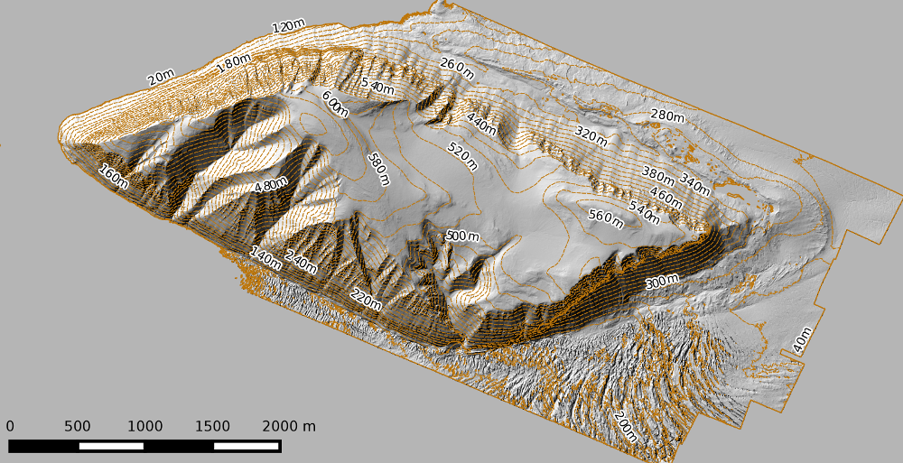

LiDAR DEM Tutorial
===================

This tutorial introduces some of the tools available in arsf_dem for creating a Digital Elevation Model (DEM) from lidar point clouds.

The data used for the tutorial are from an ARSF flight over Svalbard in 2011.
To access these data you need need to register for an account at NEODC_ and apply for access to the ARSF archive (`direct link <https://services.ceda.ac.uk/cedasite/resreg/application?attributeid=arsf>`_).

Once you have access to the ARSF Archive at NEODC you can access the flight `here <http://browse.ceda.ac.uk/browse/neodc/arsf/2011/EUFAR11_02/EUFAR11_02-2011_187_SVALBD_PGLACIAL/LiDAR>`_.

You can also follow the tutorial with data from another flight, remembering to set the file names and projection accordingly.

This tutorial assumes Windows is being used and all pre-requisites and scripts have already been installed.
However, usage is the same when running under Linux / OS X apart from you need to add '.py' to the end of all command line tools.
If you are copy and pasting commands you also need to use '\\' where commands span multiple lines rather than '^'.

Create a DSM using the command line utility
---------------------------------------------

The recommended way to create a Digital Surface Model (DSM), which represents the
top of canopy and buildings is to utilise the `create_dem_from_lidar` script
line tool. Under Linux / OS X the script needs to be called using
`create_dem_from_lidar.py` and is run from a standard terminal.

Create a LiDAR DSM
~~~~~~~~~~~~~~~~~~~~

1. Open the OSGeo4W Shell
2. Navigate to the directory the directory containing the discrete LiDAR data point cloud (LAS format). E.g, if you have saved the tutorial data to the C: drive:

.. code-block:: text

   cd C:\lidar_dem_tutorial\

3. Run the following command to create a DSM using only LiDAR data:

.. code-block:: text

   create_dem_from_lidar --in_projection UTM33N ^
                         --outdem EUFAR11_02-2011-187_dsm.dem ^
                         las1.0

This will create a DSM from each line in the folder 'las1.0' and then create a mosaic from all lines at the default resolution (2 m).
The flag '--in_projection' is used to specify the projection of the LAS files is UTM33N, it this is not provided it will default to UKBNG.

As part of the process of creating a DSM, only points which are the first return are kept and any points flagged as noise (class 7) are dropped.

Using the extension 'dem' provides an ENVI format file (binary with text header), it is also possible to export other formats (e.g., GeoTiff)
by changing the extension.

It will take a couple of minutes to run, while it is running you will output to the terminal showing a temporary ASCII file being created from the LAS file using the las2txt_ command, dropping class 7 and keeping only the first return. 
This ASCII file is then imported into GRASS_ and gridded at the specified resolution taking the mean elevation of all points in each cell. Once all files have been imported into GRASS and gridded a mosaic is generated and exported.

The mosaic can be opened in TuiView (if installed) by typing:

.. code-block:: text

   tuiview EUFAR11_02-2011-187_dsm.dem

or another packages such as QGIS or ArcMap.

4. To help visualise the data you can create a hillshade image using the gdaldem_ command:

.. code-block:: text

   gdaldem hillshade ^
         EUFAR11_02-2011_187_dsm.dem ^
         EUFAR11_02-2011_187_dsm_hillshade.tif

5. You can also create contour lines using the gdal_contour_ command:

.. code-block:: text

   gdal_contour -i 20 -a elevation ^
         EUFAR11_02-2011_187_dsm.dem ^
         EUFAR11_02-2011_187_dsm_20m_contours.shp

Create a LiDAR / ASTER DSM for use in APL
~~~~~~~~~~~~~~~~~~~~~~~~~~~~~~~~~~~~~~~~~~~~~

To create a DSM from the LiDAR, suitable for using in the Airborne Processing
Library (APL) to geocorrect hyperspectral data, some extra consideration are needed:

   * The DSM needs to use WGS-84 Lat/Long projection and heights need to be relative to the WGS-84 ellipsoid.
   * Areas of no-data need to be filled (e.g., with a courser resolution DEM).
   * The format needs to be ENVI Band Interleaved by Line (BIL) or Band Sequential (BSQ).

The same `create_dem_from_lidar` script can be used to generate a DSM for use in APL, by setting some options.
Again, open the OSGeo4W Shell and navigate to the directory containing LiDAR data.
Then run the following command

.. code-block:: text

   create_dem_from_lidar --in_projection UTM33N ^
                         --out_projection WGS84LL ^
                         --lidar_bounds ^
                         --demmosaic EUFAR11_02-2011-187-ASTER.dem  ^
                         --outdem EUFAR11_02-2011-187-lidar_ASTER-wgs84_latlong.dem ^
                         las1.0

This will create a DSM mosaic from the LAS files in 'lidar_files_dir',
reproject (horizontally and vertically) to WGS84 Lat/Long and patch with
'EUFAR11_02-2011-187-ASTER.dem' (as provided with ARSF hyperspectral delivery), cropped to the bounding box of all LiDAR data plus a buffer of 2 km.

This assumes the vertical datum of the data is the same as that required for the
output projection. 

To use ASTER or SRTM files you have downloaded yourself, which use vertical heights relative to the
geoid you can subset and reproject first. The first step is to create a virtual raster from all downloaded tiles using gdalbuildvrt_

.. code-block:: text

   gdalbuildvrt srtm_mosaic.vrt tile1.tif tile2.tif

The second step is to subset and apply a height offset to the DEM

.. code-block:: text

   create_apl_dem --demmosaic strm_mosaic.vrt ^
                     --separation_file geoid-spheroid/ww15mgh.grd ^
                     --bil_navigation flightlines/navigation ^
                     --outdem 2014_088_strm.dem

Where:

`--separation_file` is a file providing the separation between the geoid and the spheroid.

`--bil_navigation` is a folder containing the processed BIL format navigation files
produced by APL and supplied with delivered hyperspectral data.

Note, if running under Linux / OS X `create_apl_dem.py` needs to be used.

Create DSM / DTM using additional programs
--------------------------------------------

In addition to the default of creating a DSM using GRASS, a DSM or Digital Terrain Model (DTM)
can be created using LAStools or SPDLib if they are installed (and a license is available for LAStools).
These packages offer more advanced interpolation and classification of ground returns.

Creation of a DEM can be done in a Python script, using functions from the arsf_dem library, or through
command line tools.

Command line tools
~~~~~~~~~~~~~~~~~~~

Two utility command line tools are provided to call the Python functions for
producing a DSM / DTM `las_to_dsm` and `las_to_dtm` (remember to add .py on the end if not running under windows)

To create a DSM using GRASS the following is used

.. code-block:: text

   las_to_dsm -o LDR-EUFAR11_02-2011-187-01_grass_dsm.tif ^
              --projection UTM33N ^
              --method GRASS ^
              las1.0\LDR-EUFAR11_02-2011-187-01.LAS

The format of the output file is set using the extension, using '.tif' will create a GeoTIFF.

Other programs such as LAStools_ (if a license is available [1]), SPDLib_, FUSION_ and points2grid_ can be used by setting the `--method` flag [2].
If these programs require data to be converted to different formats, this will be done within the script using temporary files.

Creating a DTM, which represents the elevation of a 'bare-earth' (i.e., with no buildings or vegetation) requires first identifying ground returns and then creating a raster using only these points. When GRASS is used the last return is assumed to be a ground return, which is not always a good assumption in dense vegetation.

Other programs (e.g., LAStools_, SPDLib_ and FUSION_) have more advanced methods for classifying ground returns (see their respective manuals for more details).
When a method which allows classification of ground returns is specified the `las_to_dtm` script first classifies ground returns, saving to a temporary file, and then creates DTM from this.

To create a DTM `las_to_dtm` is used:

.. code-block:: text

   las_to_dtm -o LDR-EUFAR11_02-2011-187-01_spdlib_dtm.tif ^
              --projection UTM33N ^
              --method SPDLib ^
              las1.0\LDR-EUFAR11_02-2011-187-01.LAS

In this case using a progressive morphology filter to classify ground returns and a Natural Neighbour interpolation implemented within SPDLib.

A comparison of DTMs and DSMs generated using these tools is shown below:

.. image:: figures/dtm_dsm.png
   :width: 40 %
   :align: center

Note, depending on the cover the default classification and interpolation parameters used by `las_to_dtm` may not provide the best results.
In these cases it is recommended you access the programs directly, as this will provide more control over the available options.

.. [1] It is possible to run LAStools without a license but it will add diagonal black lines to the output file and add small amounts of noise. For details of licensing LAStools see the LAStools_ website.
.. [2] Note these programs are not affiliated with ARSF and have their own support systems (normally mailing lists). See their respective websites for more details on getting help.

.. _NEODC: http://neodc.nerc.ac.uk/
.. _gdalbuildvrt: http://www.gdal.org/gdalbuildvrt.html
.. _las2txt: http://www.cs.unc.edu/~isenburg/lastools/download/las2txt_README.txt
.. _GRASS: http://grass.osgeo.org/grass64/manuals/r.in.xyz.html
.. _gdaldem: http://www.gdal.org/gdaldem.html
.. _gdal_contour: http://www.gdal.org/gdal_contour.html
.. _SPDLib: http://spdlib.org
.. _LAStools: http://rapidlasso.com/lastools/
.. _FUSION: http://forsys.cfr.washington.edu/fusion/fusion_overview.html
.. _points2grid: https://github.com/CRREL/points2grid

